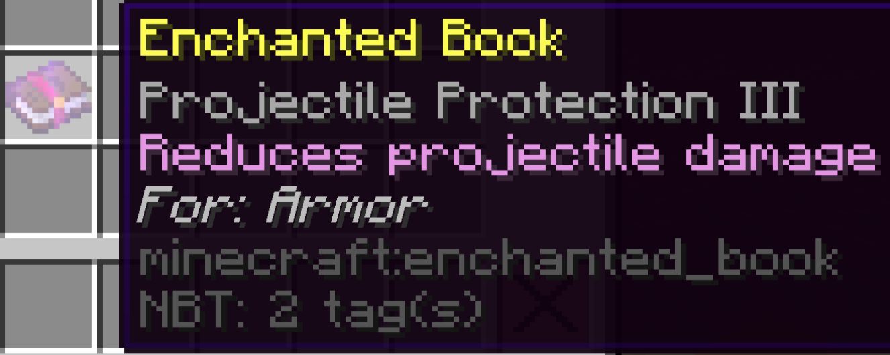

# EnchantmentDetails

A small datapack that adds descriptions to enchantment books

This datapack will have nearly no effect on performance - There is no code that runs every tick.

 

 ## Modifications
 If you wish to modify this datapack, feel free to use the python scripts found inside of the scripts/ directory. They are used to generate all the files for advancements, functions and item_modifiers.

Theses scripts require the pandas to read the spreadsheet file.
```
pip install pandas
```

The enchantment names (as given in Minecraft's code), the descriptions and what items the enchants apply to can be edited in the spreadsheet "Enchantment Details.xlsx".