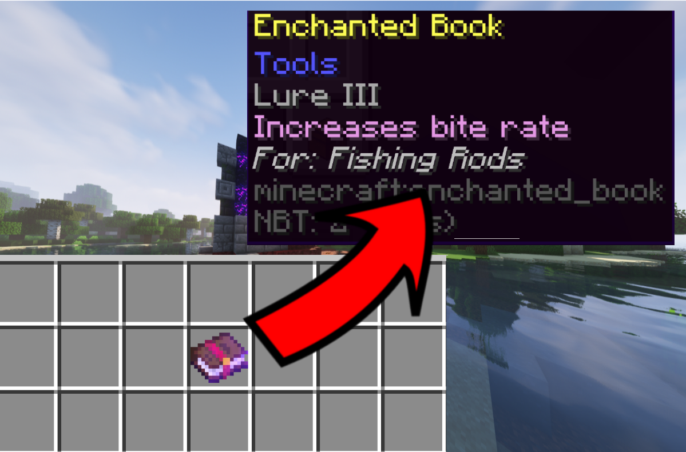

# EnchantmentDetails
 pull
 A small datapack that adds descriptions to enchantment books

This datapack will have nearly no effect on performance - There is no code that runs every tick.

 

 ## Modifications
 If you wish to modify this datapack, feel free to use the python scripts found inside of the scripts/ directory. They are used to generate all the files for advancements and functions. Theses scripts have no dependencies other than python 3.8 or higher. Descriptions for the enchanted books are found in data/enchdetails/item_modifiers
